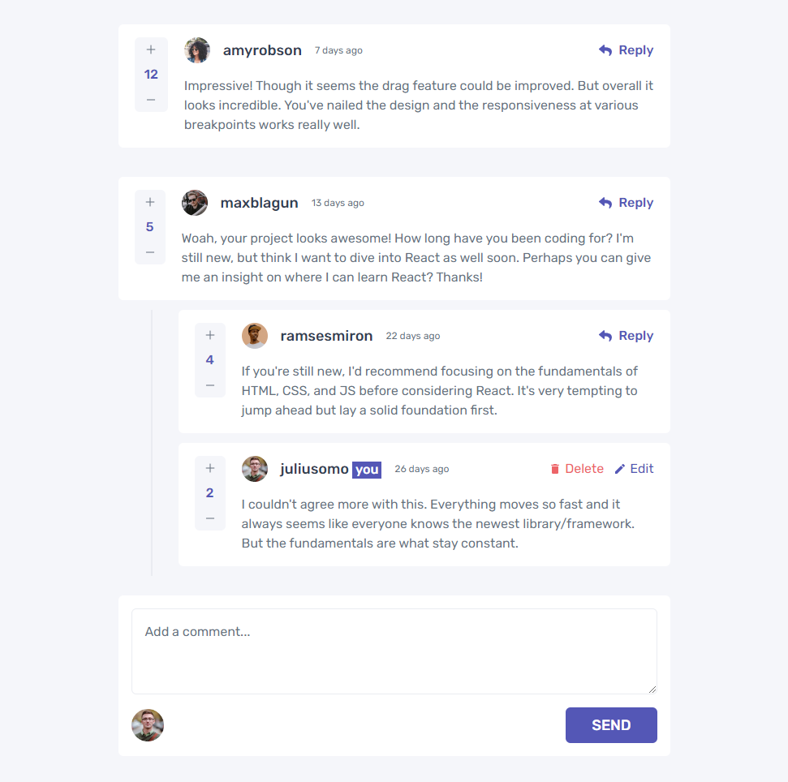
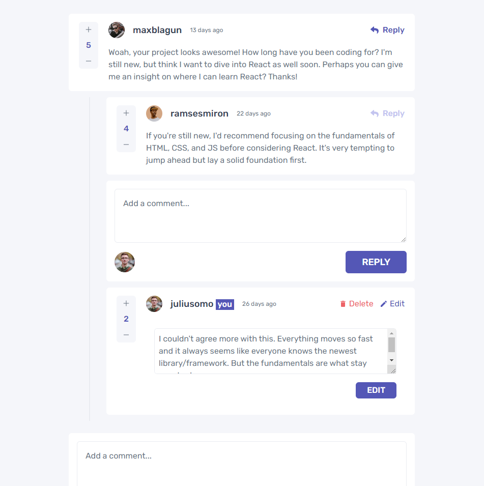
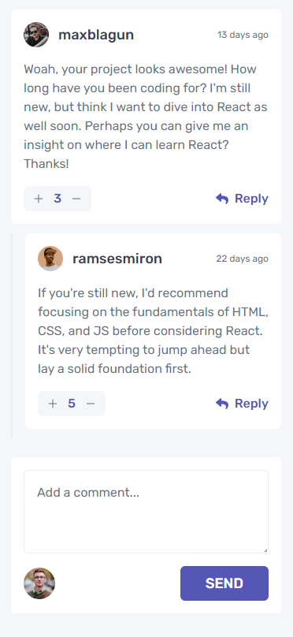
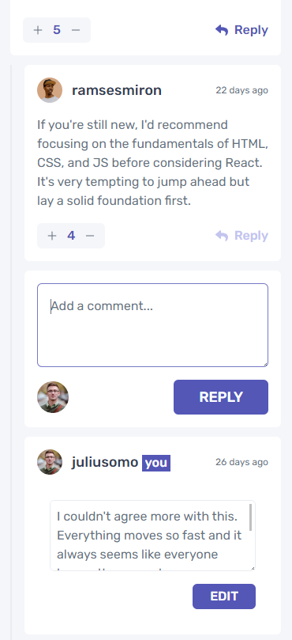

# Frontend Mentor - Interactive comments section solution

This is a solution to the [Interactive comments section challenge on Frontend Mentor](https://www.frontendmentor.io/challenges/interactive-comments-section-iG1RugEG9). Frontend Mentor challenges help you improve your coding skills by building realistic projects.

## Table of contents

- [Overview](#overview)
  - [The challenge](#the-challenge)
  - [Screenshot](#screenshot)
  - [Links](#links)
- [My process](#my-process)
  - [Built with](#built-with)
  - [What I learned](#what-i-learned)
  - [Continued development](#continued-development)

## Overview

Frontend Interactive comment app built with React

### The challenge

Users should be able to:

- View the optimal layout for the app depending on their device's screen size
- See hover states for all interactive elements on the page
- Create, Read, Update, and Delete comments and replies
- Upvote and downvote comments
- **Bonus**: If you're building a purely front-end project, use `localStorage` to save the current state in the browser that persists when the browser is refreshed.
- **Bonus**: Instead of using the `createdAt` strings from the `data.json` file, try using timestamps and dynamically track the time since the comment or reply was posted.

### Screenshot

### Links

- [Solution URL](https://github.com/Toby2507/interactive-comment-app)
- [Live Site URL](https://reactinteractivecomments.netlify.app/)

## My process

- Setup my react project with create-react-app
- Divide page and functionalities into components
- Design the mobile version of the css
- Add functionlities ( I used react context api, useReducer, useEffect )
- Make the page responsive by adding desktop view
- Final house-keeping

### Built with

- Semantic HTML5 markup
- TailwindCSS
- Flexbox
- CSS Grid
- Mobile-first workflow
- [React](https://reactjs.org/) - JS library

### What I learned

While working on this project I became more proficient with the use of React hooks and context api. I'm more confident in my work and I learnt to make my code more streamlined and none repeatitive.

### Continued development

I plan to develve into the following framework/languages in the comming weeks:

- React-Redux
- React(Next.js)
- TypeScript
